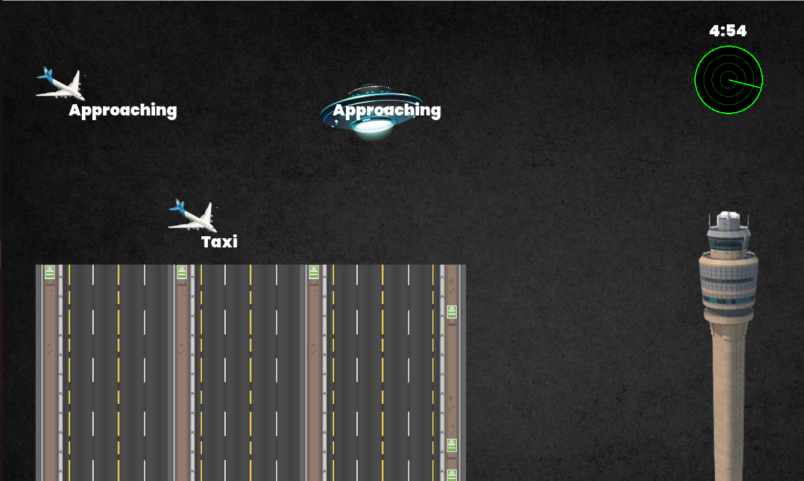
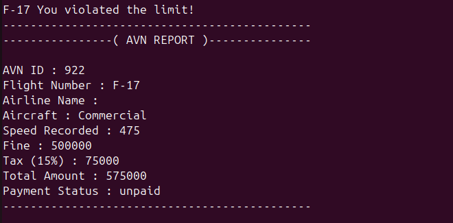

\# Welcome to Air Traffic Control X

\*\*AirControlX\*\* is a terminal and SFML-based simulation of an
automated multi-runway \*\*Air Traffic Control System\*\* for an
international airport. It is built using C++ and utilizes \*\*Operating
System concepts\*\* such as:

\- Multi-threading - Processes - Inter-process communication (IPC) -
Synchronization (Mutexes & Semaphores) - Scheduling - Resource
management

This project visualizes live flight management.

\## Features

\- Visualization of Live flight arrivals and departures with
scheduling - Flight threads simulating real-time control - Use of
semaphores and mutexes to manage runways (shared resources) -
Priority-Based + FCFS scheduling algorithms for landing and takeoff
queues - Radar thread continuously monitors flights violations -
Multiple Processes for violation handling

\## Software Requirements

\- \*\*Ubuntu (20.04 or later)\*\* - \*\*g++ / gcc\*\* (C++ compiler) -
\*\*SFML 2.5+\*\*

\### Installation (Ubuntu)

sudo apt update sudo apt install g++ libsfml-dev make

\### Execution (Ubuntu) g++ final_module.cpp -o AirControlX -pthread
-lsfml-graphics -lsfml-window -lsfml-system && ./AirControlX

## 🖼️ Simulation Snapshots

